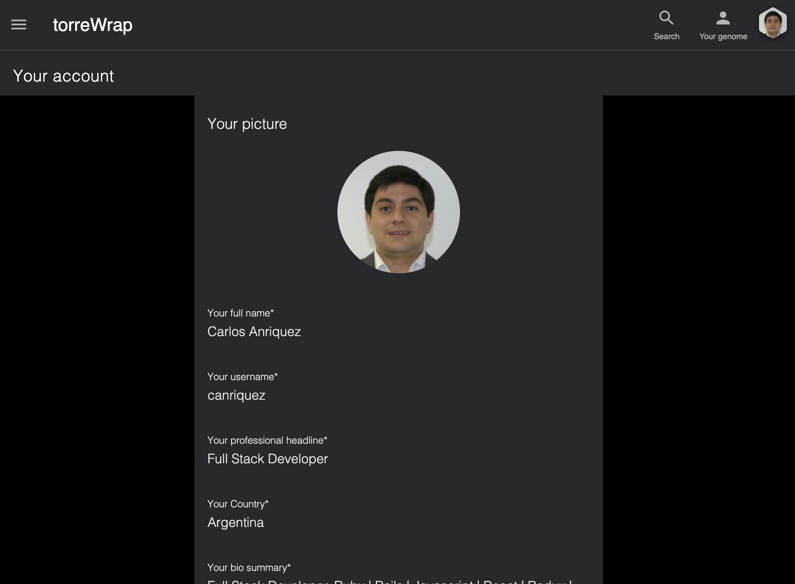

[](https://app.netlify.com/sites/torrewrap/deploys)

# TorreWrap - Full Stack Application

> From-end application that uses API information from the site Torre.co. This application uses a Ruby on Rails [backend repository](https://github.com/canriquez/torrewrap-api) to hit Torre.co API endpoints for the required data.

## Current User Story

The user login or create an account at torreWrap, using Torre.co valid user name. This torreWrap user will then fetch profile information from Torre.co and show additional functionalities on top of the existing Torre.co features. Currently, two main functions are working:

### Getting torreWrap access using an existing account
> The user can log in into the torreWrap backend using a valid TorreCo user:

- Currently, example works with user: canriquez

- When the user enters the Torre.co username, the app will check the username validity using the torreWrap-API endpoint.
- The torreWrap-API will hit the Torre.co API to fetch the required user. If this operation fails, then the front end will not progress until a valid user is submitted.
- After a valid user is provided (canriquez), the app will show the form to enter the password.
- The user must provide a valid TorreWrap-API password. Currently, the only user stored in TorreWrap-API has the password.

`12345`

- When the correct password is submitted, the home page will be rendered using Torre.co API information

### Creating a new torreWrap account using `any` Torre.co valid user account
- When the user enters a Torre.co username, the app will check the username validity using the torreWrap-API endpoint.
- The torreWrap-API will hit the Torre.co API to fetch the required user. If this operation fails, then the front end will not progress until a valid user is submitted.
- After a valid '''any''' valid Torre.co user is provided, the app will invite the user to add a password to create the new torreWrap account. 
- After the signup process is done, the app will show the current Torre.co profile information.



# Additional description about the project and its features.

## Built With

- React.js, CRA, Webpack, Babel
- HTML5/CSS3, Javascript ES6
- material-ui
- ESlint, Stylelint
- VSCode

## Live Demo @Netlify

[Live Demo Link](https://torrewrap.netlify.app/)

## Getting Started

To get a local copy up and running, follow these simple steps.

Clone or fork the [repo](https://github.com/canriquez/torrewrap.git)

\*note you have to install npm or yarn.

- [npm](https://www.npmjs.com/get-npm)
- [yarn](https://classic.yarnpkg.com/en/docs/install)

## How it Works

This webpage is built on ES6 & React basis. All of the resources (images, fonts) and .js files are located inside `/src` folder.

## Install

### `yarn start`

Runs the app in the development mode.<br />
Open [http://localhost:3000](http://localhost:3000) to view it in the browser.

The page will reload if you make edits.<br />
You will also see any lint errors in the console.

### `yarn build`

Builds the app for production to the `build` folder.<br />
It correctly bundles React in production mode and optimizes the build for the best performance.

The build is minified and the filenames include the hashes.<br />
Your app is ready to be deployed!

See the section about [deployment](https://facebook.github.io/create-react-app/docs/deployment) for more information.

### Run tests

- Run the test suite app for store actions with
  ```
  $ npm test
  ```

## Authors

👤 **_Carlos Anriquez_**

- Github: [@canriquez](https://github.com/canriquez)
- Twitter: [@cranriquez](https://twitter.com/cranriquez)
- Linkedin: [linkedin](https://www.linkedin.com/in/carlosanriquez/)
- Portfolio: [carlosanriquez.com](https://www.carlosanriquez.com)

## 🤝 Contributing

Contributions, issues, and feature requests are welcome!

Feel free to check the [issues page](issues/).

## Show your support

Give a ⭐️ if you like this project!

## Acknowledgments

Family and friends!

## 📝 License

This project is [MIT](lic.url) licensed.
